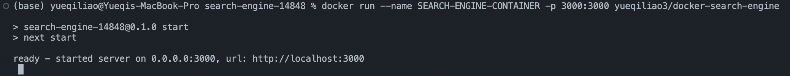
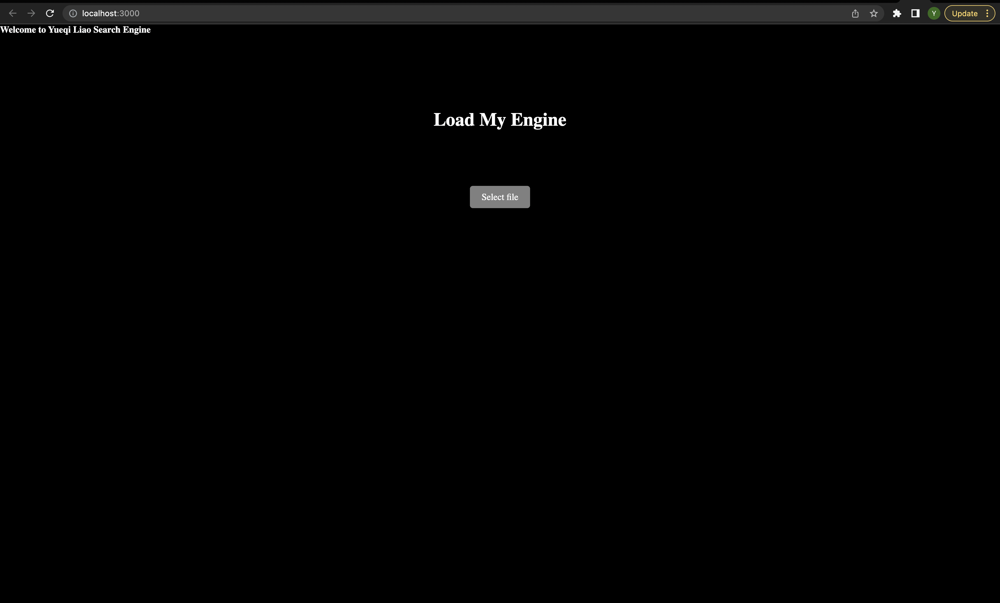
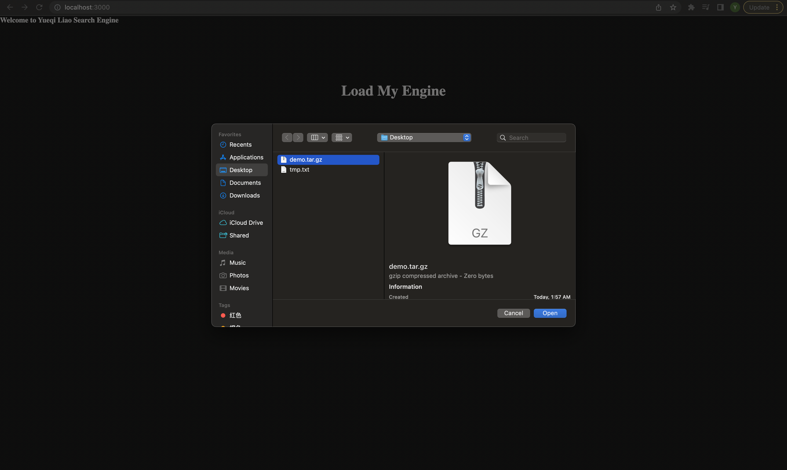
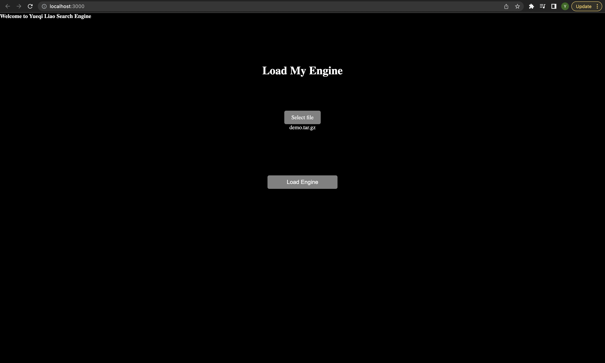
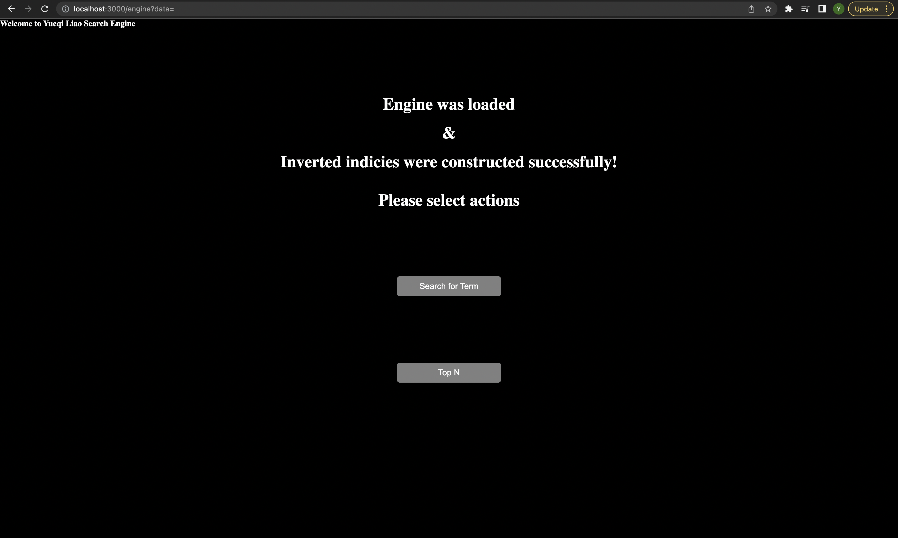
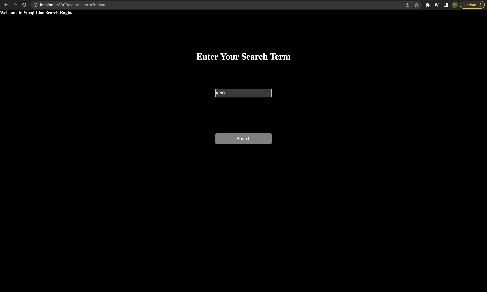
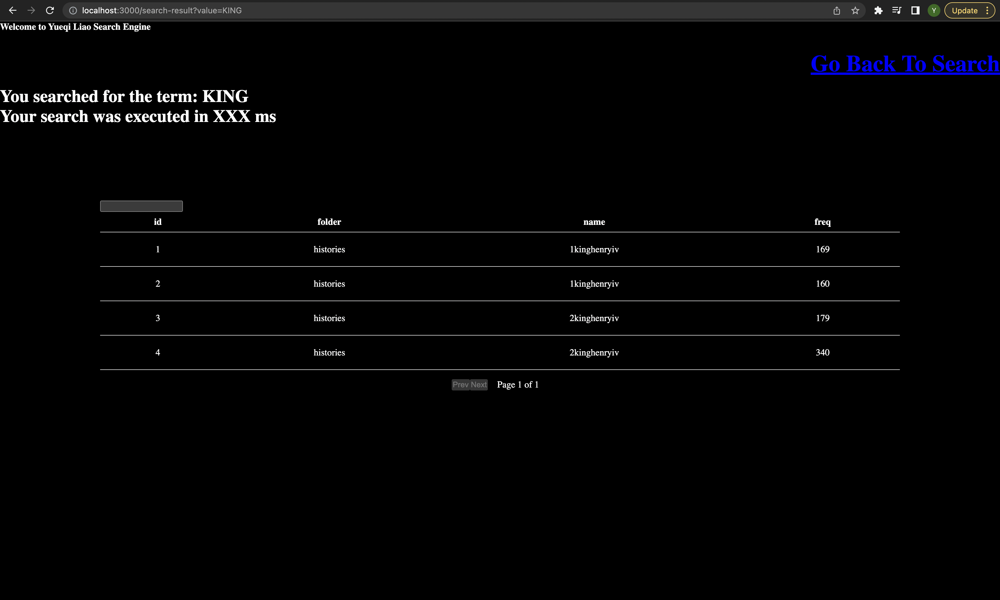
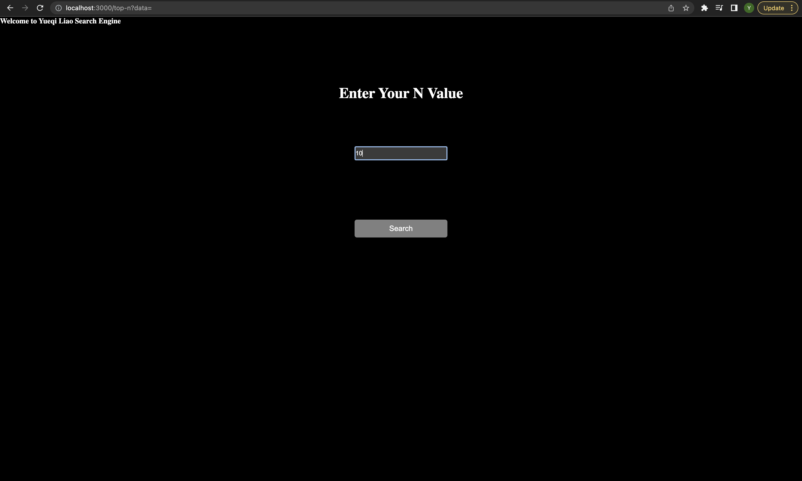
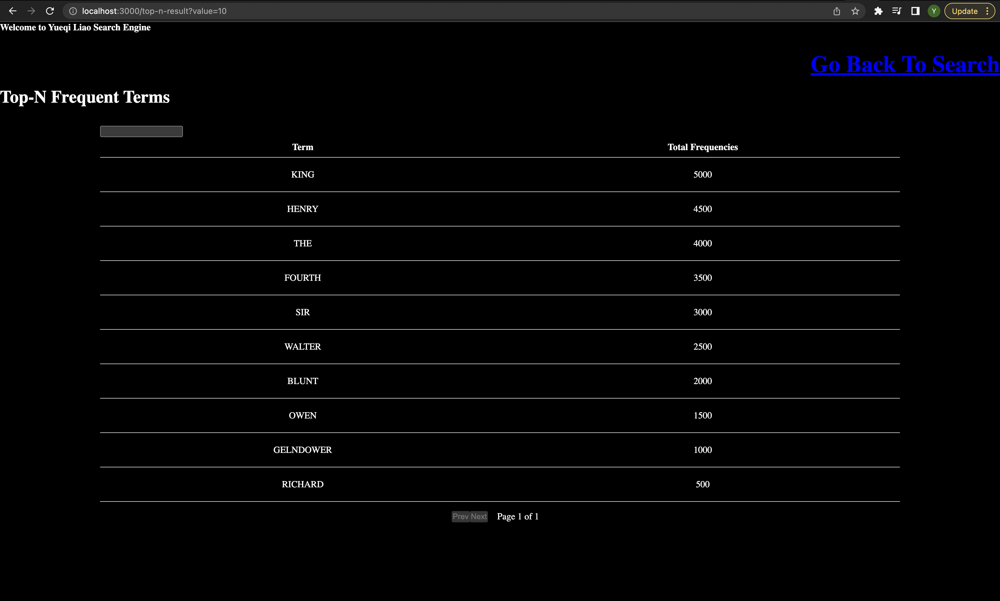

# course-project-option-ii-ikemenyuki

## 1. Steps to Reproduce the Solution

### step 1: Install Dependencies

To accurately reproduce a solution function, it is essential to install all necessary dependencies. To achieve this, execute the following command:

```
npm install
```

If `npm` is not installed on your machine, it is recommended to install `Node.js` first. This can be achieved by executing the appropriate command for your operating system. For instance, for Linux users, the following command can be executed:

```
sudo apt-get install nodejs npm
```

Alternatively, macOS users can use Homebrew to install npm by executing the following command:

```
brew install node
```

Another option is to download and install Node.js from the official website [https://nodejs.org/](https://nodejs.org/).

### step 2: Run the Solution

To execute the solution, enter the following command:

```
npm run dev
```

Next, open a web browser and navigate to [http://localhost:3000](http://localhost:3000) or the specific port displayed in the command prompt.

## 2. link to the DockerHub Registry

The Docker image for the search engine solution can be found at
[https://hub.docker.com/repository/docker/yueqiliao3/docker-search-engine/general](https://hub.docker.com/repository/docker/yueqiliao3/docker-search-engine/general)
To download the Docker image, execute the following command:

```
docker pull yueqiliao3/docker-search-engine
```

To run the solution within a container using the downloaded Docker image, execute the following command:

```
docker run --name SEARCH-ENGINE-CONTAINER -p 3000:3000 yueqiliao3/docker-search-engine
```

This will start the container and make the search engine application accessible at [http://localhost:3000](http://localhost:3000) in your web browser.

## 2. Images of the Working Solution

Below are screenshots of the containerized application running in a web browser.

##### Command Prompt

This image shows the command prompt after starting the application with Docker:


##### Landing Page

This image displays the landing page:


##### Selecting Files

This image shows the page for selecting files to load into the search engine:


##### After file selection

After selecting a file, this image shows the loaded file in the search engine:


##### Loading the Search Engine

After clicking the "Load Engine" button, the search engine is loaded:


##### Search Term Page

After clicking the "Search for Term" button, this image shows the page for entering a search term:


##### Search Result Page

After entering a search term, this image shows the search results page:


##### Top N Frequencies Page

To search for the top N frequencies, click the "Top N" button on the search engine page:


##### Top N Frequencies Result Page

Select the desired value of N and click the "Search" button to display the top N frequencies:


##### Back to the Search Engine Page

To return to the search engine page, click the `Go Back To Search` button.
Overall, these images demonstrate the functionality and usability of the search engine application.

## 3. Disclaimer

As this is the project checkpoint, the data used in the containerized application are toy data and can be found in the `src\testdataset` folder. These datasets were created based on the project mockup and do not represent actual data.
