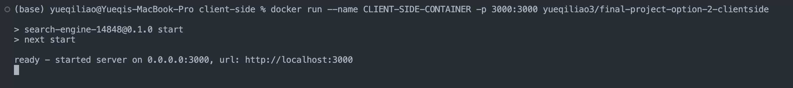
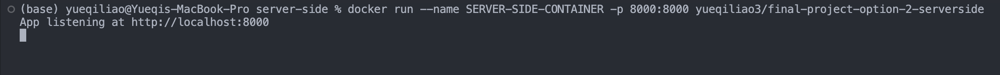
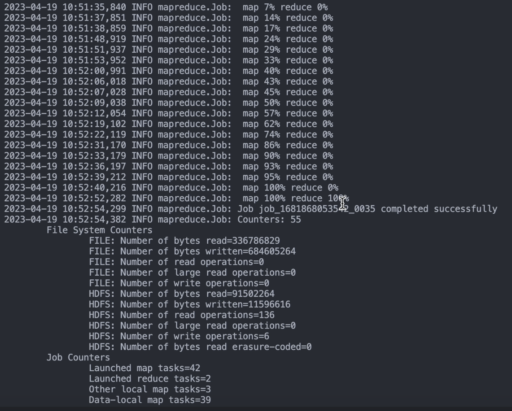

[](https://classroom.github.com/a/HbBTCtpi)
# course-project-option-ii-ikemenyuki

## 1. Link to the Final Project Code Walkthrough and Project Demo
[https://youtu.be/QisRjMv4asE](https://youtu.be/QisRjMv4asE)

## 2. Steps to Reproduce the Solution

### step 1: Install Dependencies

To accurately reproduce a solution function, it is essential to install all necessary dependencies. To achieve this, execute the following command:

```
cd client-side && npm install
cd server-side && npm install
```

If `npm` is not installed on your machine, it is recommended to install `Node.js` first. This can be achieved by executing the appropriate command for your operating system. For instance, for Linux users, the following command can be executed:

```
sudo apt-get install nodejs npm
```

Alternatively, macOS users can use Homebrew to install npm by executing the following command:

```
brew install node
```

Another option is to download and install Node.js from the official website [https://nodejs.org/](https://nodejs.org/).

### step 2: Run the Solution

To execute the solution, first start the client application:

```
cd client-side
npm run dev
```

Then, start the server-side application:
```
node server.js
```

Next, open a web browser and navigate to [http://localhost:3000](http://localhost:3000) or the specific port displayed in the command prompt.

## 3. link to the DockerHub Registry

The Docker image for the client-side application can be found at
[https://hub.docker.com/repository/docker/yueqiliao3/final-project-option-2-clientside/general](https://hub.docker.com/repository/docker/yueqiliao3/final-project-option-2-clientside/general)
The Docker image for the server-side application can be found at
[https://hub.docker.com/repository/docker/yueqiliao3/final-project-option-2-serverside/general](https://hub.docker.com/repository/docker/yueqiliao3/final-project-option-2-serverside/general)
To download the Docker images, execute the following command:

```
docker push yueqiliao3/final-project-option-2-clientside
docker push yueqiliao3/final-project-option-2-serverside
```

To run the solution within a container using the downloaded Docker image, execute the following command:

```
docker run --name clientsidecontainer -p 3000:3000 yueqiliao3/final-project-option-2-clientside
docker run --name clientsidecontainer -p 8000:8000 yueqiliao3/final-project-option-2-serverside
```

This will start the both the client and server side containers and make the client-side application accessible at [http://localhost:3000](http://localhost:3000) in your web browser.

## 4. Variable Resplacement and Other Details

To successfully run the application, you will need some modificationon on the server-side code, otherwise you will be directed to my GCP account.

In `server-side/server.js`, update these variables according to your own GCP cluster and your local username.

```
const hadoopClusterHomePath = '/home/path/to/your/directory';
const clusterName = 'clusterName';
const projectId = 'projectID';
const zone = 'zone'
const clusterUserName = 'clusterUserName'
```

These variables are important to setting up connections with your GCP cluster master node as well as the HDFS on you cluster, so be careful replacing them.

Currently, the `mapper.py` file used in this project only includes these stop words:

```
stop_words = ['a', 'about', 'above', 'after', 'again', 'against', 'all', 'am', 'an', 'and', 'any', 'are', "aren't", 'as', 'at', 'be', 'because', 'been', 'before', 'being', 'below', 'between', 'both', 'but', 'by', 'can', "cannot", 'could', "couldn't", 'did', "didn't", 'do', 'does', "doesn't", 'doing', "don't", 'down', 'during', 'each', 'either', 'else', 'enough', 'etc', 'even', 'ever', 'every', 'few',
              'for', 'from', 'further', 'get', 'gets', 'got', 'had', 'has', 'have', 'he', 'her', 'here', 'hers', 'herself', 'him', 'himself', 'his', 'how', "how's", 'i', 'if', 'in', 'into', 'is', "isn't", 'it', "it's", 'its', 'itself', 'just', 'least', 'let', 'like', 'likely', 'may', 'me', 'might', 'more', 'most', 'must', 'my', 'myself', 'neither', 'no', 'nor', 'not', 'of', 'off', 'often', 'on', 'only', 'or', 'other']
```

If you want to update this `stop_words` list to include more stop words or modify this list, go to `server-side/mapper.py` to update this list and upload it to your GCP cluster.

## 5. Images of Docker Running Both Client-Side and Server-Side



## 6. Image of Hadoop MapReduce Successful Completion
